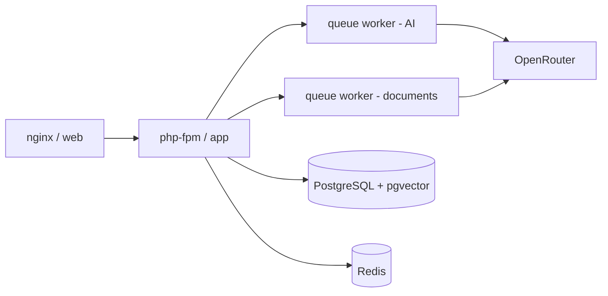

# ASSISTENT — AI-ассистенты для бизнеса

Платформа для создания AI-ассистентов, которые помогают бизнесу общаться с клиентами: отвечают на вопросы, используют базы знаний, собирают заявки и ведут диалог как живой человек.

---

## Возможности

### 🤖 Ассистенты
- **Создание ассистента за минуту** — мастер из 3 шагов: «Задача» → «Общение» → «Знания».
- **AI-генерация конфигурации** — опишите бизнес, и AI сам заполнит цель, стиль общения, приветствие, инструкции и обработку нехватки информации.
- **Готовые ниши** — автосалон, клиника, отель, фитнес, недвижимость и другие. Шаблон подставляется автоматически.
- **Своё направление** — если ниша не подходит, можно вписать любую (например, «генерация видео»), и AI учтёт специфику.
- **Кнопка «Подставить пример»** — мгновенно вставляет шаблон описания бизнеса.

### 📚 Базы знаний
- Загрузка документов: **PDF, DOC, DOCX, TXT, MD** (до 20 МБ, несколько файлов).
- Добавление информации текстом/Markdown.
- **AI-черновик** — генерация черновика базы знаний из описания бизнеса.
- Автоматическая индексация: документ разбивается на чанки, создаются векторные эмбеддинги (pgvector).
- Привязка баз знаний к ассистентам.

### 💬 Диалоги
- **Тестовый чат** для проверки ассистента.
- Ассистент **использует прикреплённые базы знаний** и отвечает по фактам.
- **Человечный диалог** — учитывает историю, задаёт уточняющие вопросы, предлагает варианты.
- Определение **лидов** (телефон, email, намерение купить) с уведомлениями в Telegram.

### 🔌 Интеграции
- **Telegram**, **Avito**, **MAX** — подключение каналов связи.
- Токены хранятся в зашифрованном виде.
- Вебхуки для входящих сообщений.

### 💰 Баланс и использование
- Кошелёк пользователя, история операций.
- Учёт AI-запросов: модели, токены, стоимость, статус.
- Резервирование средств и возврат при ошибках.

### 🛠 Администрирование
- Дашборд платформы, управление пользователями.
- Настройка ключа **OpenRouter**, курса валют, коэффициента наценки.
- Маршрутизация моделей по задачам (ответ, обработка знаний, генерация, embedding, лиды, память, проверка фактов).
- Синхронизация моделей, аудит действий, проверка здоровья сервисов.

---

## Технологии

| Слой | Технология |
|------|------------|
| Бэкенд | PHP 8.3, Laravel |
| Фронтенд | React + TypeScript (Vite) |
| БД | PostgreSQL + **pgvector** (векторный поиск) |
| Кеш/очереди | Redis |
| AI | OpenRouter (модели Gemini, GPT, DeepSeek) |
| Контейнеры | Docker Compose (nginx + php-fpm + workers) |

---

## Архитектура



- **`app`** — PHP-FPM, обрабатывает HTTP-запросы.
- **`web`** — nginx, раздаёт статику и проксирует API.
- **`worker`** — очередь `integrations, ai, notifications, default` (ответы ассистента, лиды).
- **`documents`** — очередь `documents` (индексация документов, чанки, эмбеддинги).
- **`scheduler`** — планировщик задач (отложенная индексация и т.д.).

---

## Структура проекта

```
app/
  Http/Controllers/   — API-контроллеры (Auth, Assistant, Knowledge, Conversation, ...)
  Jobs/                — фоновые задачи (GenerateAssistantReply, ProcessKnowledgeDocument, ...)
  Models/              — Eloquent-модели (Assistant, KnowledgeBase, Conversation, Lead, ...)
  Services/            — OpenRouterGateway, ConversationEngine, Retriever, Settings, ...
config/assistent.php   — настройки AI (модели, пороги, тарифы)
deploy/                — Dockerfile, nginx, скрипты развёртывания
database/migrations/   — схема БД
resources/js/app.tsx   — фронтенд (React SPA)
routes/web.php         — маршруты API
```

---

## Быстрый старт

### 1. Клонирование и настройка

```bash
git clone git@github.com:letoceiling-coder/assistent.rinulik.ru.git
cd assistent.rinulik.ru
cp .env.example .env
```

Заполните в `.env`:

```dotenv
APP_URL=https://assistent.rinulik.ru
DB_PASSWORD=<секрет>
OPENROUTER_API_KEY=<ваш ключ OpenRouter>
ADMIN_EMAIL=admin@example.com
ADMIN_INITIAL_PASSWORD=<пароль администратора>
```

### 2. Сборка и запуск (Docker)

```bash
docker compose up -d --build
docker compose exec app php artisan migrate --seed
docker compose exec app php deploy/assign_models.php
```

### 3. Доступ

- Панель: `https://assistent.rinulik.ru`
- API: `https://assistent.rinulik.ru/api/v1`

---

## Настройка AI (OpenRouter)

Платформа использует **OpenRouter** как единый AI-провайдер. Для каждой задачи назначается модель:

| Задача | Назначение |
|--------|-----------|
| `conversation` | Ответ ассистента |
| `knowledge_processing` | Обработка знаний |
| `knowledge_generator` | Генерация знаний |
| `assistant_generator` | Генерация ассистента |
| `embedding` | Векторные эмбеддинги |
| `lead_detection` | Определение лида |
| `summary` | Память диалога |
| `grounding` | Проверка фактов |

Модели можно сменить в разделе **Администрирование → AI и модели**.

---

## Лицензия

Проект распространяется по лицензии MIT.

## Ветка `scrooty` → https://scrooty.ru

Отдельная копия платформы на том же сервере: `/opt/scrooty.ru/` (git-клон ветки `scrooty`), compose-проект `scrooty`, свои Postgres/Redis, внутренний порт `127.0.0.1:18743`, в общий шлюз `rinulik-nginx-1` добавлен только `conf.d/scrooty.conf`.

Деплой (на сервере):

```sh
sh /opt/scrooty.ru/deploy/scrooty/deploy.sh
```

Файлы деплоя: `deploy/scrooty/`.
